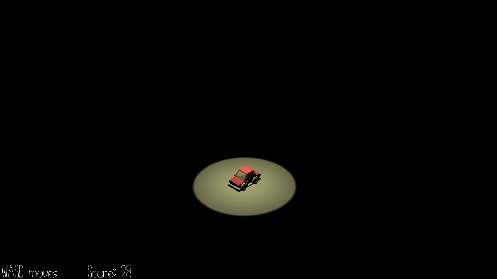

# Dangerous Midnight Treat

Author: Jianxiang Li, Zizhuo Lin

Design: 
Follow the direction of sound in the darkness to complete a path towards the ice cream truck. Randomized unique path every game.

Midnight treats are dangerous not only because it might let you gain unnecessary weight!

Screen Shot:

How To Play:

Move in the grids with WASD keys. Follow the direction of music played by the ice cream truck. 

Staying on a wrong cell that is not on the path of ice cream truck will make you fall.

Difficulties increases after each time you get to the target as you can stay for less time on the wrong cell before falling.

Sources:

Car models: \
License: CC0 1.0 Universal (CC0 1.0) Public Domain Dedication \
provided by Kenny @ https://kenney.nl/assets/car-kit

Icecream model: \
License: CC0 1.0 Universal (CC0 1.0) Public Domain Dedication
\
provided by Kenny @ https://kenney.nl/assets/food-kit

Death and victory Sound effect(nice_one.opus, maybe_next_time.opus): \
License: Attribution-NonCommercial 3.0 Unported (CC BY-NC 3.0)\
Cartoon Voice Bean Game Set #3\
provided by Alex Fritz @ https://freesound.org/people/FritzSounds/
https://freesound.org/people/FritzSounds/sounds/435062/

Ice cream cart music(Organ-Filler.opus):\
Organ Filler \
Written by Kevin MacLeod @ https://freepd.com/comedy.php \
Copyright free, Free for Commercial Use, Free Of Royalties, Free Of Attribution.

This game was built with [NEST](NEST.md).

